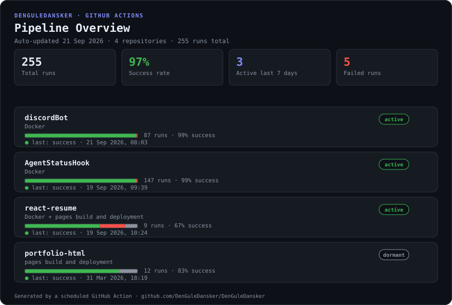

## Pipelines

## Contributions
<picture>
  <source media="(prefers-color-scheme: dark)" srcset="https://raw.githubusercontent.com/DenGuleDansker/DenGuleDansker/output-3d-contrib/night.svg">
  <source media="(prefers-color-scheme: light)" srcset="https://raw.githubusercontent.com/DenGuleDansker/DenGuleDansker/output-3d-contrib/day.svg">
  
</picture>

## Stats:

 

